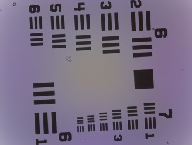
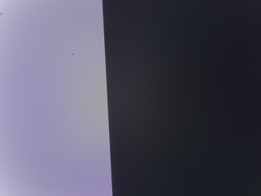
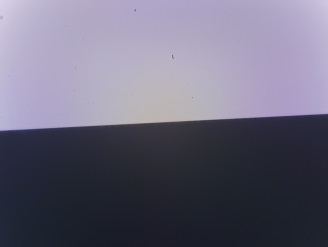

# Microscope optical calibration scripts

The scripts in this folder take a series of measurements that can be used to characterise the optical performance of a microscope.  For details of what parameters are measured and how the images are analysed, see the [usaf analysis repository](https://github.com/rwb27/usaf_analysis/).  In brief, it should measure resolution, field curvature, field distortion, and (if you use a USAF target) magnification.

## Controlling the Raspberry Pi
You can plug in a monitor and keyboard to the Raspberry pi and run it normally, or you can SSH in and use the keyboard on your laptop.  NB if you use SSH, the images are still displayed on the Raspberry Pi, so you still need a monitor attached - just not a keyboard.  If you're using SSH, it works best if the Raspberry Pi connects to or creates a WiFi network when it starts up.

In the case of the WaterScope image, you can control it with the following steps:
* Download and install [PuTTY](https://www.chiark.greenend.org.uk/~sgtatham/putty/latest.html) (google it...)
* Download and install [WinSCP](https://winscp.net/eng/download.php) to copy files across
* Turn on the pi
* Connect to waterscope_wifi (password waterscope)
* Go to http://10.0.0.1/html/ in a web browser and click "stop"
* Open PuTTY, enter 10.0.0.1 as the address, and click "connect"

## Calibration protocol
This is a simple protocol to acquire lots of images of edges, which can then be used to recover the resolution and distortion of a microscope.  It is designed to use a USAF calibration target, but if that's not available, any slide with horizontal and vertical edges will work.  This script should be run on a Raspberry Pi connected to an [Openflexure Microscope](https://github.com/rwb27/openflexure_microscope), using the ["Sangaboard" motor controller](https://github.com/rwb27/openflexure_nano_motor_controller).  

From an SSH terminal or from the command line, change to the directory where the control scripts are located, and run microscope_control.  For example:
```bash
cd microscope_rwb
python microscope_control.py 
```

To make a new directory for experiments, and make a shortcut:
```bash
mkdir cambridge_100x_plan_ac127
ln -s cambridge_100x_plan_ac127/ ce
```
This will create a directory called ``cambridge_100x_plan_ac127`` and create a "symbolic link" (a sort of shortcut) called ``ce``.  This saves a lot of typing in later commands.

First, find the centre of the USAF pattern using ``microscope_control.py`` above - i.e. you type:
```bash
python microscope_control.py
```
Press "v" to enable the video feed, and probably press "f" a couple of times to increase step size.  Use the arrow keys or WASD to move around, and Q/E to focus.  Once you have a sharp image of the centre of the USAF target (i.e. the smallest group), you can press "j" to save a JPEG image.  NB images you save using this program may be half-quality depending on the version, and they are stored in Desktop/images (you'll need to copy them into the experiment folder manually).  You should have something that looks like the image below - don't worry if it's not the right way up, or if it's slightly squint (the analysis program can cope with some amount of tilt).



Press "x" to quit the interactive program, and  save a full-resolution, raw image into the experiment folder with:
```bash
raspistill -t 0 --raw ce/usaf_image_raw.jpg
```
To generate a smaller, jpeg-only version, you can use the [raw data stripping script](https://github.com/rwb27/usaf_analysis/blob/master/strip_raw_data.py) on the raw image, or the command below:
```bash
raspistill -t 0 ce/usaf_image.jpg
```
Optionally, you can save a Z-stack of the USAF target:
```bash
python acquire_zstack.py ce/usaf_zstack 100 20
```
The arguments in the command above are
1. The folder where you want to save images (nb it should not exist - you can remove it with rmdir ce/usaf_zstack if the command failed previously)
2. The number of microsteps to move
3. The number of images to acquire

Next, run ``python microscope_control.py`` again, and centre the vertical edge of a large square in the field of view.  You should see something that looks like the image below:



As before, exit the control script by pressing "x" and run:
```bash
python measure_distortion.py ce/distortion_v 40 0 40
```
Arguments:
1. Output folder
2. Shift between images in X (in steps)
3. Shift between images in Y
4. Number of images
This will make a folder of images of the edge, moving it horizontally across the field of view.  We use this to measure distortion.

The vertical edge should still be centred. You can now run:
```bash
python scan_edge.py ce/vertical_edge_zstacks
```
Arguments:
1. Output folder
2. (optional) shift in X (500 is sensible)
3. (optional) shift in Y (use 0)
This takes a z stack of images of the edge after autofocusing.  If you specify the optional X and Y shifts, it does this three times, once in the centre and once either side.  The repeated version is useful because it measures the resolution at the edges of the image, rather than just in the centre.

Using ``python microscope_control.py`` as before, centre a horizontal edge in the field of view, so you have an image like the one below:



Now, repeat the above tests for the horizontal edge:
```bash
python measure_distortion.py ce/distortion_h 0 40 30
python scan_edge.py ce/horizontal_edge_zstacks
```

You should now have four folders of edge images, plus the USAF target images, plus (optionally) a Z-stack series of USAF images.  This is everything you need to run the [analysis scripts](https://github.com/rwb27/usaf_analysis/) on, and characterise the microscope.  Copy those files and folders off the Pi (using a USB stick or WinSCP) for analysis later.  To shut down the pi, type:
```bash
sudo shutdown -h now
```
